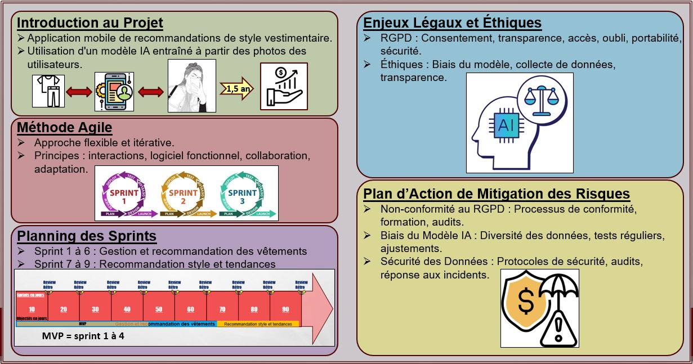

# Cadrage-Projet-IA-SCRUM-p10

**Projet de formation professionnalisant, dans le rôle d'un IA Product manager** : 

Fashion-Insta souhaite développer une application mobile de recommandation d'articles vestimentaires basée
sur des photos, permettant aux utilisateurs de prendre des selfies avec leurs vêtements préférés pour recevoir
des suggestions d'articles similaires. L'application sera hébergée sur Microsoft Azure et doit être présentée lors
du prochain comité exécutif pour décision finale sur son lancement.

* Analyse des Besoins : Synthèse des besoins métiers pour l'application mobile à partir des ateliers avec
l'équipe produit.
* Backlog de User Stories : Formalisation des user stories dans un backlog priorisé en utilisant la méthode
MoSCoW.
* Estimation des Charges : Évaluation de la charge en jours par profil pour chaque user story et répartition en
pourcentage.
* Chiffrage Financier : Calcul du coût initial de développement incluant les coûts des ressources humaines et
l'infrastructure Azure.
* Planification Agile : Définition du planning des sprints avec le contenu détaillé en fonction des priorités
définies.
* Analyse des Risques : Identification, évaluation et priorisation des risques liés au projet, y compris ceux liés à
la gestion des données personnelles et aux biais du modèle.
* Conformité RGPD : Mise en place d'un registre de traitements conforme aux directives de la CNIL pour les
données personnelles traitées par l'application.
* Présentation pour le COMEX : Élaboration du support de présentation incluant les objectifs du projet, les
ressources nécessaires, la méthode agile, les points de suivi, les enjeux légaux et éthiques, le plan d'action pour les
risques, et le backlog des user stories.
* Préparation du Support de Présentation : Création d'une slide résumant les points clés, ainsi que des slides
détaillant les objectifs, les ressources requises, la méthode agile, l'organisation des points de suivi, les enjeux
légaux et éthiques, et le plan d'action pour les risques.

## Livrables :
* **Gamba_Lucas_1_backlog_062024** :
  Backlog des user stories des besoins en développement de l'application, organisés par sprint en fonction de leur priorité, en partie évaluée avec la méthode MOSCOW.
* **Gamba_Lucas_2_tableur_062024** et **Gamba_Lucas_2_tableur_062024_correction** :
  tables de chiffrage de la rentabilité du projet et de l'évaluation des risques (notamment liés aux données et aux biais du modèle IA).
  **_correction** prend en compte les coûts d'infrastructures MS AZURE dans la première année de développement + production qui avaient été oublié dans la première version.
* **Gamba_Lucas_3_presentation_062024** :
  Présentation Power Point du projet en condition de COMEX (COMité EXécutif) d'entreprise.
